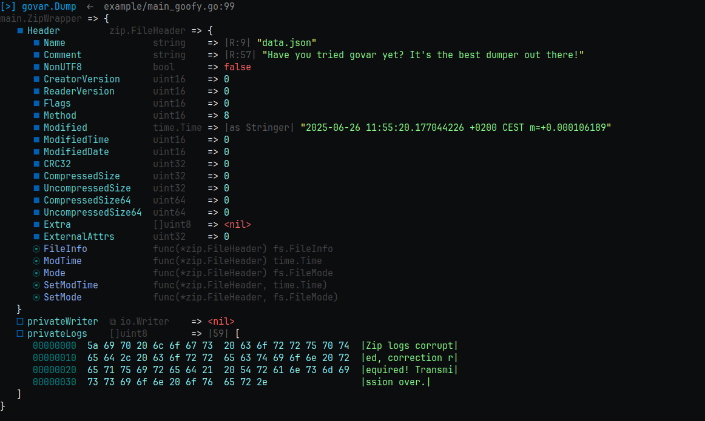

# govar

`govar` is a flexible, zero-dependency Go variable inspector and pretty-printer.

It helps you **visualize Go data structures** deeply and colorfully. Dump variables to stdout, collect structured debug strings, render HTML dumps for UIs, and even introspect your own codebase with `who`.

[>] Designed for **debugging**, **exploration**, **documentation**, and **interface analysis**.

- ✅ Covered with table-driven tests
- ✅ Goroutine safe
- ✅ Highly readable output
- ✅ Well-documented
- ✅ Type & interface introspection tools

Whether you're debugging, documenting, or just staring into the void of your own data structures — `govar` is here to make sense of it all.

---

## 🤔 Why use `govar`?

`fmt.Printf("%+v", x)` is fine...
Until your variable turns into a cryptic jungle of pointers, interfaces, and nested maps.

That’s where govar shines.

It doesn’t just dump your data - it decodes it. With colors, types, method sets, lengths, and even byte slice hexdumps that don’t hurt to look at.

And if you're wondering "what does this type even implement?" — govar has answers. It can explore your codebase and show what implements what, without the guesswork.

---

<p align="center">
<strong>Example output</strong><br>
  
</p>

## ✨ Features at a Glance

| Feature | Description |
|--------|-------------|
| 🎨 Pretty‑prints any Go value | Nested structs, slices, pointers, maps, funcs, interfaces, channels |
| 🌈 Output options | Colorized ANSI, raw text, or full HTML |
| 🔎 Rich meta info | Type hints, field visibility (`⯀`, `🞏`, `⦿`), size, cap, length, etc. |
| 🔁 Reference tracking | Detects cycles, shared pointers |
| 🧾 Hex dump | Nicely formatted hexdump for `[]byte`, `[]uint8` and similar |
| 🧠 Code introspection | Find type → interface, interface → type relationships |
| 💾 Dump anywhere | To stdout, to `io.Writer`, to string, or HTML |
| 🧰 Customizable | Use `DumperConfig` to define exactly how you want dumps to work |

## 🚀 Install

```bash
go get github.com/janvaclavik/govar
```

## 🛠 Quickstart

```go
package main

import (
	"github.com/janvaclavik/govar"
)

func main() {
	// Dump to stdout, with types, meta, and colors
	govar.Dump(someVarToInspect1, someVarToInspect2, ...)

	// Dump values only (colored, but no extras)
	govar.DumpValues(someVarToInspect1, someVarToInspect2, ...)

	// Dump to string, with types, meta, and colors
	str := govar.Sdump(someVarToInspect1, someVarToInspect2, ...)

	// Dump to string, values only (colored, but no extras)
	plain := govar.SdumpValues(someVarToInspect1, someVarToInspect2, ...)

	// Dump to io.Writer (e.g. file, buffer), with types, meta, and colors
	govar.Fdump(someIOWriter, someVarToInspect1, someVarToInspect2, ...)

	// Dump to io.Writer, values only (colored, but no extras)
	govar.FdumpValues(someIOWriter, someVarToInspect1, someVarToInspect2, ...)

	// Dump to HTML string, with types, meta, and colors
	html := govar.HTMLdump(someVarToInspect1, someVarToInspect2, ...)

	// Dump to HTML string, values only (colored, but no extras)
	htmlPlain := govar.HTMLdumpValues(someVarToInspect1, someVarToInspect2, ...)

	// Dump and terminate the program (great for those "I just want to see it and bail" moments)
	govar.Die(someVarToInspect1, someVarToInspect2, ...)
}
```

## ⚙️ Custom Dumper
Need more control over what and how things are printed? Use govar.Dumper directly.
```go
import (
	"github.com/janvaclavik/govar"
)

func main() {
	// Create a custom dumper with your own settings
	myCfg := govar.DumperConfig{
		IndentWidth:         3,       // indentation step
		MaxDepth:            15,      // nesting level limit
		MaxItems:            100,     // max elements in a collection before trunc
		MaxStringLen:        10000,   // the limit for string dumping
		MaxInlineLength:     80,      // the limit for inline value rendering
		ShowTypes:           true,    // shows extra type info if true
		UseColors:           true,    // plain text if false
		TrackReferences:     true,    // tracks references to objects
		HTMLtagToken:        "span",  // token wrapping tag for HTML dumps
		HTMLtagSection:      "pre",   // block wrapping tag for HTML dumps
		EmbedTypeMethods:    true,    // shows implemented methods on any type
		ShowMetaInformation: true,    // shows sizes, capacities, "rune length", etc
		ShowHexdump:         true,    // shows classic hexdump on byte[] or uint8[]
	}

	d := govar.NewDumper(myCfg)

	// Now you Dump your data with full control
	d.Dump(myData1, myData2)
	d.Fdump(someIOWriter, myData1, myData2)
	s := d.Sdump(myData1, myData2)
	h := d.SdumpHTML(myData1, myData2)
}
```

## 🔍 The "Who" Introspection Helpers

```go
package main

import (
	"github.com/janvaclavik/govar/who"
)

func main() {
  // Which types in my code implement this interface?
  types := who.Implements("myrepo/mypkg.SomeInterface")

  // Which interfaces in my code are implemented by this type?
  interfaces := who.Interfaces("myrepo/mypkg.MyType")

  // Which external interfaces (stdlib, etc) are implemented by this type?
  externals := who.InterfacesExt("myrepo/mypkg.MyType")
}
```

### 🧭 Summary of who functions
| Function              | Description                                                               |
| --------------------- | ------------------------------------------------------------------------- |
| `who.Implements()`    | Returns types in your codebase that implement a given interface           |
| `who.Interfaces()`    | Lists interfaces in your codebase that a given type implements            |
| `who.InterfacesExt()` | Lists interfaces from stdlib and imported packages a given type satisfies |


## 🧩 License

MIT © [janvaclavik](https://github.com/janvaclavik)

## 🙏 Inspired by
- [davecgh/go-spew](https://github.com/davecgh/go-spew)
- [yassinebenaid/godump](https://github.com/yassinebenaid/godump)
- [goforj/godump](https://github.com/goforj/godump)
- [nette/tracy](https://github.com/nette/tracy) *(PHP's dump() inspiration)*
- [laravel/laravel](https://github.com/laravel/laravel) *(another PHP's dump() inspiration)*
- [pprint](https://docs.python.org/3/library/pprint.html) *(pprint — Python pretty printer)*

## 📇 Author

Made with ☕️ and reflective thought by [Jan Vaclavik](https://github.com/janvaclavik)

